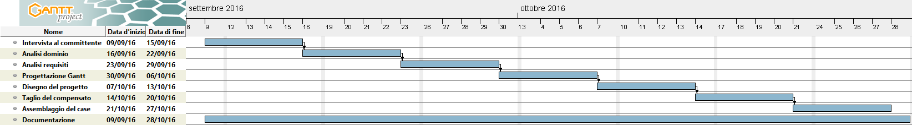

# Arduino Case, Implementazione

1. [Introduzione](#introduzione)

  - [Informazioni sul progetto](#informazioni-sul-progetto)

  - [Scopo](#scopo)

1. [Implementazione](#implementazione)

1. [Test](#test)

  - [Protocollo di test](#protocollo-di-test)

  - [Risultati test](#risultati-test)

  - [Mancanze/limitazioni conosciute](#mancanze/limitazioni-conosciute)

1. [Consuntivo](#consuntivo)

1. [Conclusioni](#conclusioni)

  - [Sviluppi futuri](#sviluppi-futuri)

  - [Considerazioni personali](#considerazioni-personali)

1. [Allegati](#allegati)

## Introduzione

### Informazioni sul progetto

Scuola: SAMT - Scuola Arti e Mestieri Trevano  
Sezione: Informatica  
Materia: Progetti

Allievi:
  - Alessandro Narciso
  - Riccardo di Summa
  - Nico Ambrosini
  - Massimo Saia
  - Carlo Bogani
  - Jonathan Fassora
  - Pietro Belfanti
  - Federico Weithaler
  - Alessio Tocchetti

Docente responsabile
  - Luca Muggiasca
  - Adriano Barchi

Data di inizio: 09.09.2016  
Data di consegna (Case dell'Arduino): 21.10.2016  
Data di consegna (Documentazione e Presentazione): 28.10.2016

## Implementazione

### Taglio del legno

Ho inizialmente disegnato i pezzi con le esatte dimensioni sul legno. Dopo averlo fatto per tutte le parti del case, le ho ritagliate lasciando un minimo margine che poi ho rifinito con la "lisciatrice".
Infine, per ritagliare le due prese dietro all'arduino e il foro per tasto reset, ho usato un traforo che mi bucasse il centro della parte scelta per far sì che potessi ritagliare i pezzi direttamente partendo dal "dentro".

### Assemblaggio

Quando avevo i pezzi (sopra, sotto, coperchio laterale, lato dietro, lato destro e sinistro con incisioni) ritagliati, limati, bucati e pronti per l'assemblaggio, ho proceduto usando la colla per il legno.
Ho iniziato attaccando la base con il retro, dopodiché ho montato i due lati "incisi" fissandoli al retro e sul sotto, incollato il "tetto" sopra ai due lati.

### Chiusura
Per la chiusura del case sono andato dunque a fissare il velcro sull'estremità sopra e sotto del case (al lato dell'apertura), dopodiché facendo poi la stessa cosa anche sul "coperchio" (alle estremità).

## Test

### Protocollo di test

|Test Case       | TC-001                               |
|----------------|--------------------------------------|
|**Nome**        | Testare il prodotto |
|**Riferimento** | REQ-001                               |
|**Descrizione** | Verificare che il prodotto sia idoneo alle disposizioni dateci dal cliente |
|**Prerequisiti**| Avere il prodotto assemblato |
|**Procedura**   | Fare varie prove di lasciare cadere il case da 1 metro di altezza per testarne la resistenza |
|**Risultati attesi** | Il prodotto deve restare intatto senza rompersi |

### Risultati test

| Test | Stato |
|------|-------|
|TC-001|Passato|

### Mancanze/limitazioni conosciute

L'idea iniziale per la chiusura del case era quella di usare dei magneti,
ma non potendo averli a disposizione per problemi di acquisti, abbiamo
risolto usando del velcro.

## Consuntivo

La tempistica di questo progetto

## Conclusioni

Questo case ideato solamente per l'Arduino non avrà di certo un impatto
di "rivoluzione", menchemeno nel mondo.
L'idea fondamentale del progetto non era quella di costruire un vero e
proprio case, ma di fare un prototipo assimilando allo stesso tempo, soprattutto le
basi di teoria sui progetti. Tutto a scopo didattico.

### Sviluppi futuri

Alcune migliorie che potranno essere sviluppate saranno per esempio come
l'utilizzo di un legno (compensato) più spesso in modo da garantire una
maggiore resistenza e dunque applicare delle viti al posto della colla.
Si potrà anche prendere in considerazione la creazione del case tramite stampante 3D.

### Considerazioni personali

A parer mio, da questo progetto ho imparato soprattutto la parte teorica
piuttosto che la parte pratica poiché secondo me un progetto di "falegnameria"
in questo ambito non era del tutto coerente. Nel complesso comunque posso dire
che mi ha aiutato a rappresentare la "prima idea" di progetto.
La cosa interessante è stata la responsabilità del gestire un progetto in
maniera autonoma (anche se accompagnata). In ogni caso è stato un ottimo punto
di partenza per i progetti futuri.

## Allegati

- Diari di lavoro reperibili online al seguente indirizzo: 
  https://github.com/AlNar/ArduinoCase/tree/master/Documentazione/Diari

- Modello 3D del case: 
  https://github.com/AlNar/ArduinoCase/blob/master/Documentazione/0_Modello3D.skp

- Q/A Verbale: 
  https://github.com/AlNar/ArduinoCase/blob/master/Documentazione/0_Verbale_Q%26A.md
