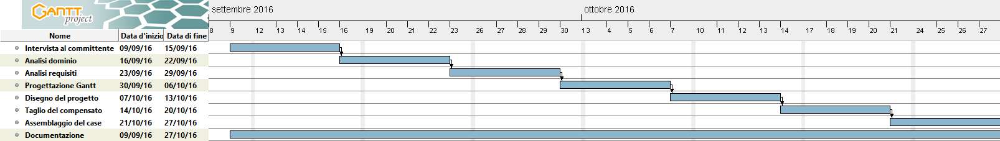

# Arduino Case, Progettazione

1. [Introduzione](#introduzione)

  - [Informazioni sul progetto](#informazioni-sul-progetto)

  - [Abstract](#abstract)

  - [Scopo](#scopo)

1. [Analisi](#analisi)

  - [Analisi del dominio](#analisi-del-dominio)

  - [Analisi e specifica dei requisiti](#analisi-e-specifica-dei-requisiti)

1. [Use case](#use-case)

  - [Pianificazione](#pianificazione)

  - [Analisi dei mezzi](#analisi-dei-mezzi)

1. [Progettazione](#progettazione)

## Introduzione

### Informazioni sul progetto

Scuola: SAMT - Scuola Arti e Mestieri Trevano  
Sezione: Informatica  
Materia: Progetti

Allievi:
  - Alessandro Narciso
  - Riccardo di Summa
  - Nico Ambrosini
  - Massimo Saia
  - Carlo Bogani
  - Jonathan Fassora
  - Pietro Belfanti
  - Federico Weithaler
  - Alessio Tocchetti

Docente responsabile
  - Luca Muggiasca
  - Adriano Barchi

Data di inizio: 09.09.2016  
Data di consegna (Case dell'Arduino): 21.10.2016  
Data di consegna (Documentazione e Presentazione): 28.10.2016

### Abstract

  > *As the everyday use of the Arduino increase, a new protection system
  > must be created to prevent the damage and increase the security.
  > At the same time it has to be light and manageable. Then, we decided
  > to create a solid shield that will stop the user to worry about the
  > safety of his Hardware and making him concentrating on the Software.
  > We decided to recreate a new design every component of the case.
  > We started making more intuitive the opening of the case. So now you
  > can just open the case by simply strap the frontside. In addition of
  > this, you'll not anymore have the need of remove the Arduino from the
  > case for insert the cables, but just link them using the pins on the
  > 2 sides. All of this innovative functions will help you to improve your
  > work without worry about the safeness of the hardware.*

### Scopo

  Lo scopo del progetto è quello di fornire una protezione al nostro Arduino che,
  essendo spesso spostato ovunque, ha il rischio di rompersi. Abbiamo così ideato un
  case costruito in compensato che potesse resistere (almeno da un metro) e soddisfare i nostri requisiti. 
  Il secondo scopo principale era quello di costudire il nostro Arduino anche
  per lungo tempo, senza creare problemi con la polvere o il riscaldamento.
  Tutto questo però è stato fatto a scopo didattico in modo da insegnarci le basi di come
  funziona un progetto.

## Analisi

### Analisi del dominio

  Il case per l'Arduino sarà usato solamente dall'utente che lo possiede con lo scopo
  di tenerlo al sicuro.  Tale dovrà essere abbastanza resistente da non spaccarsi cadendo
  da 1 metro e proteggendo in qualunque caso l'Arduino dell'utente.  Esistono vari tipi di case
  per l'Arduino, ma probabilmente non saranno fatti di compensato, nè avranno un modello come
  il mio (ideato con _Riccardo di Summa_). Un modello con l'apertura sulla facciata
  davanti tramite il velcro, delle striscie bucate per far slittare le "prolunghe" dei i pin
  sull'Arduino, il buco per il tasto di reset e i buchi sulla facciata posteriore, credo proprio
  che non sia mai stato ideato. Abbiamo inoltre lavorato per portare un modello facile e primitivo
  all'utilizzo.

### Analisi e specifica dei requisiti

  |ID          |REQ-001               |
  |------------|----------------------|
  |**Nome**    | Struttura Case       |
  |**Priorità**| 1                    |
  |**Versione**| 1.0                  |
  |            | **Sotto requisiti**  |
  |**001**     |Deve essere costruito in compensato.|
  |**002**     |Deve resistere da una caduta massima di 1 metro.|
  |**003**     |Deve riuscire a contenere un Arduino Uno.|
  |**004**     |Deve esserci un buco per tutti i fili e l'alimentazione.|
  |**005**     |Deve essere fissato al case.|
  |**006**     |Deve esserci una chiusura fissata o ad incastro.|
  |**007**     |Deve essere grande abbastanza da contenere l'arduino calcolando lo spessore del compensato.|
  |**008**     |Deve avere dei fori per la fuori uscita dell'aria calda|

### Use case

### Pianificazione

### Analisi dei mezzi

#### Software

- Google SketchUp 16.1.1449 (x64)
  - Usato per la realizzazione del modello 3D
- Atom 1.11.2
  - Usato per redigere i Diari e la Documentazione
- Gantt Project 2.8.1
  - Usato per fare il gantt

#### Hardware

- Compensato
  - Usato per la costruzione delle parti da assemblare
- Colla per il legno
  - Usata per assemblare il case
- Prolunghe per i pin
  - Usati per raggiungere e prolungare i pin
- Arduino Uno
  - Usato per testare la grandezza richiesta dal case
- Utensili di lavoro
  - Usati per il taglio del legno

## Progettazione

### Costi e materiali

| Materiale  | Quantità | Prezzo |
|-------------|----------|--------|
| Compensato | 200cm2 | 7 Fr. |
| Colla per il legno | - | 5 Fr. |
| Velcro | 4cm2  | 5 Fr. |
| Mano d'opera | 30 ore | 45 Fr./h (1350 Fr.) |
| **Totale**  ||  |

### Design e progettazione

Ho usato solamente la colla per assemblare tutto poiché il compensato da 4mm.

